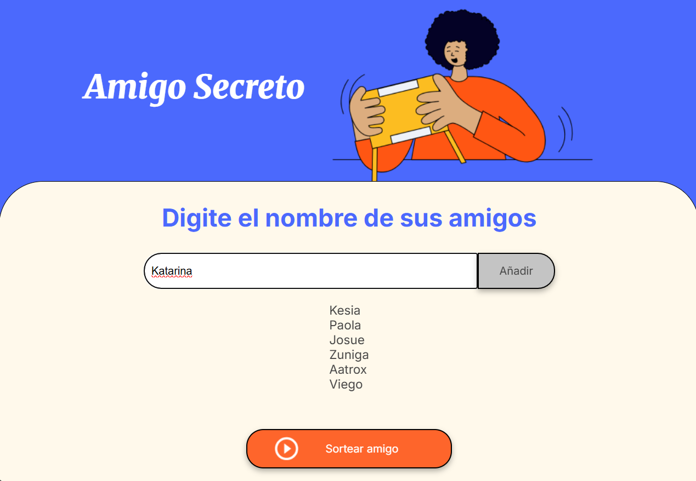
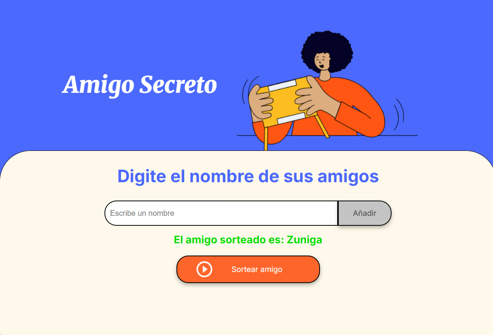

# Amigo Secreto 🎁

¡Bienvenido al proyecto **Amigo Secreto**! Esta es una aplicación web sencilla que te permite organizar un sorteo de amigos secretos. Puedes agregar nombres de amigos, ver la lista de participantes y sortear un nombre al azar.

## Características principales ✨

- **Agregar amigos**: Ingresa los nombres de tus amigos en la lista.
- **Lista de amigos**: Visualiza todos los nombres agregados.
- **Sortear amigo**: Selecciona un nombre al azar de la lista.
- **Interfaz sencilla**: Fácil de usar y con un diseño limpio.

## Capturas de pantalla 📸

### 1. Interfaz principal

_Descripción: Captura de la página principal donde se muestra el campo para agregar amigos y el botón para sortear._

### 2. Lista de amigos agregados

_Descripción: Captura que muestra la lista de amigos agregados._

### 3. Resultado del sorteo

_Descripción: Captura que muestra el resultado del sorteo con el nombre del amigo seleccionado._

## Cómo usar 🚀

1. **Agrega amigos**:
   - Escribe el nombre de un amigo en el campo de texto.
   - Haz clic en el botón **"Añadir"** para agregarlo a la lista.

2. **Sorteo**:
   - Una vez que hayas agregado varios amigos, haz clic en el botón **"Sortear amigo"**.
   - El nombre del amigo seleccionado aparecerá en la pantalla.

3. **Reiniciar**:
   - Para reiniciar la lista, actualiza la página o limpia manualmente los nombres.

## Tecnologías utilizadas 💻

- **HTML**: Estructura de la página.
- **CSS**: Estilos y diseño.
- **JavaScript**: Lógica para agregar amigos y realizar el sorteo.

## Instalación ⚙️

1. Clona este repositorio:
   ```bash
   git clone https://github.com/zr19012-prn335-cicloII-2022/Challege-Amigo-Secreto-AuraLatam-G8/tree/main
